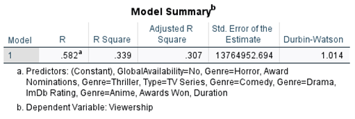

# Netflix Viewership Analysis

Statistical analysis of factors influencing viewer engagement on Netflix using regression and hypothesis testing.

---

## 🧠 Project Overview

The primary objective of this project is to conduct a thorough data analysis on Netflix, employing data from its vast repository of movies and TV series to enhance business strategies, particularly by improving Netflix's Recommendation Systems. This will involve analyzing viewership statistics provided by Netflix, spanning from January to June 2023, in tandem with IMDb ratings.

**Research questions**
1.	What factors influence the viewership of a movie or TV show on Netflix?
2.	What genre garners the highest preference among viewers?
3.	Which combination of content type and genre leads to high viewership?
4.	How can the insights gained from this analysis be utilized to develop business strategies tailored to viewer preferences?

---
## Limitations

The viewership data collected from Netflix’s engagement report cannot provide a complete picture since the viewership data only accounts for views during the period of January to June of 2023. There may be some skewness towards Netflix titles that were released between the same period.

## 🎯 Objectives

- Identify key drivers of viewership
- Analyze the impact of genre and content type
- Apply statistical models to explain engagement patterns

---

## 🗂️ Data Sources

- Netflix dataset
- IMDb ratings
- Awards data
- Wikipedia metadata

---

## 🛠️ Tools & Technologies

- IBM SPSS
- Minitab
- Tableau
- Excel

---

## 🔍 Methodology

- Data cleaning and integration
- Random Sampling
- Multiple Linear Regression
- One-way and Two-way ANOVA
- Chi-square tests
- Residual diagnostics

---

## 📈 Key Insights

- IMDb ratings and award nominations positively impact viewership
- Action genre has the highest average viewership
- Movies outperform series in certain genres
- Evidence of heteroscedasticity suggests additional influencing factors

---

## 💡 Recommendations

- Focus on high-performing genres
- Promote highly rated and award-winning content
- Optimize content mix based on genre and type interaction

---

## 📊 Netflix Viewership Dashboard

---
## 🚀 Business Impact

- Supports data-driven content strategy
- Improves engagement optimization
- Enables targeted marketing

---

## 📌 Key Takeaway

Shows application of statistical modeling techniques to real-world business problems and translating results into actionable insights.

